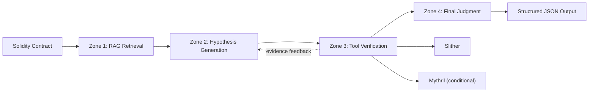

# VeriRAG-Agent

> Retrieval-augmented, tool-grounded smart contract auditing with type-aware evaluation.
>
> An intelligent contract auditing framework for paper replication and open-source system engineering: Integrating LLM, RAG, Slither, Mythril and strict vulnerability type assessment (VTA) into a single closed loop.
## Overview

VeriRAG-Agent is a research-oriented smart contract auditing framework built around a simple question:

**Can retrieval and tool feedback make LLM-based Solidity auditing more reliable at the vulnerability-type level, not just the binary vulnerable/safe level?**

The repository implements and evaluates three modes in the same codebase:

| Mode | LLM | RAG | Tools | Entry Method |
| --- | --- | --- | --- | --- |
| `Vanilla` | Yes | No | No | `auditVanilla()` |
| `RAG-Only` | Yes | Yes | No | `auditRAGOnly()` |
| `VeriRAG-Full` | Yes | Yes | Slither + Mythril | `auditFullAgent()` |

The full system does not treat tools as hard overrides. Instead, it:

1. retrieves domain evidence from a SmartBugs-style knowledge base,
2. asks the LLM to generate a structured vulnerability hypothesis,
3. runs static/symbolic tools for formal evidence,
4. feeds that evidence back into the model for a final decision.

This repository is intended for **research, reproduction, and method extension**. It is not positioned as a production-ready audit service.

## Highlights

- **Three directly comparable baselines in one codebase**: `Vanilla`, `RAG-Only`, and `VeriRAG-Full`.
- **Type-aware evaluation**: the main metric is VTA, which penalizes wrong vulnerability types even when binary detection is correct.
- **Structured output pipeline**: all modes converge to the same JSON result schema.
- **Tool-grounded feedback loop**: Slither and Mythril are used as evidence generators, not simple post-process filters.
- **Reproducible benchmark setup**: 350 vulnerable contracts across 7 categories plus 50 safe OpenZeppelin contracts.
- **Paper artifacts included**: experiment reports, plotting scripts, data tables, and the paper source are all kept in-repo.

## System Architecture




## Repository Layout

```text
.
├── src/main/java/com/xhl/xhlaiagent/
│   ├── app/                  # Core audit pipeline
│   ├── rag/                  # Retrieval + Milvus integration
│   ├── tools/                # Slither / Mythril wrappers
│   ├── advisor/              # JSON normalization and logging advisors
│   └── config/               # Spring AI / DashScope / vector store config
├── src/main/resources/
│   ├── document/smartbugs_kb/ # SmartBugs-derived RAG knowledge base
│   ├── testset/              # Vulnerable and safe benchmark contracts
│   └── application*.yml      # Spring Boot configuration
├── src/test/java/com/xhl/xhlaiagent/experiment/
│   └── PilotExperimentTest1.java
├── paper/
│   ├── data/                 # Recomputed VTA tables
│   ├── picture/              # Figures used in the paper
│   ├── scripts/              # Plotting / table / doc update scripts
│   └── overleaf_verirag_agent/
├── smartbugs-curated/        # Source dataset reference
├── SolidiFI-benchmark/       # Benchmark reference
└── Experiment_*.md           # Generated experiment reports
```

## Output Schema

All three modes return the same structured result:

```json
{
  "hasVulnerability": true,
  "vulnerabilityType": "Reentrancy",
  "vulnerabilityReason": "合约在外部调用前后状态更新顺序存在风险，可能导致重入。"
}
```

## Requirements

- Java 21
- Maven 3.9+ or the included Maven Wrapper
- Python virtual environment at `venv/`
- Milvus running on `localhost:19530`
- A compatible LLM endpoint configured for Spring AI
- `slither` available on `PATH`
- `myth` available in the repo-local virtual environment or otherwise reachable by the Java tool wrapper

## Before You Publish or Run

This repo currently contains local research configuration files. Before pushing to a public GitHub repository:

1. **Rotate any real API keys** already present in local config files.
2. Prefer **environment variables or untracked local overrides** instead of committing secrets.
3. Verify the `MythrilTool` executable path matches your own environment.

A safer public setup is to override Spring Boot configuration from the shell:

```bash
export SPRING_PROFILES_ACTIVE=coding-plan
export SPRING_AI_OPENAI_BASE_URL=https://coding.dashscope.aliyuncs.com
export SPRING_AI_OPENAI_API_KEY=<your_llm_api_key>
export SPRING_AI_OPENAI_CHAT_OPTIONS_MODEL=qwen3-coder-next
export SPRING_AI_DASHSCOPE_API_KEY=<your_embedding_api_key>
export SPRING_AI_VECTORSTORE_MILVUS_CLIENT_HOST=localhost
export SPRING_AI_VECTORSTORE_MILVUS_CLIENT_PORT=19530
```

If you prefer config files, use a local-only override such as `application-local.yml` and do not commit real keys.

## Quick Start

### 1. Clone and build

```bash
git clone <your-repo-url>
cd SmartContract-agent
./mvnw clean install -DskipTests
```

### 2. Prepare the Python environment

```bash
python3 -m venv venv
source venv/bin/activate
pip install --upgrade pip
pip install slither-analyzer mythril
```

If Mythril or Slither installation fails on your platform, follow their official installation guides:

- [Slither](https://github.com/crytic/slither)
- [Mythril](https://github.com/ConsenSysDiligence/mythril)

### 3. Start Milvus

Run a local Milvus instance and make sure it is reachable at `localhost:19530`.

On the first run, the application will automatically load the `smartbugs-curated` knowledge base from `src/main/resources/document/smartbugs_kb/` into Milvus if the dataset is not already present.

### 4. Run the application

```bash
SPRING_PROFILES_ACTIVE=coding-plan ./mvnw spring-boot:run
```

The default Spring Boot settings in this repo are:

- Port: `8123`
- Context path: `/api`

At the current stage, the repository is used primarily through the Java service layer and the experiment test harness rather than a polished public REST API.

## Reproducing the Paper Experiments

The main experiment harness is:

- [src/test/java/com/xhl/xhlaiagent/experiment/PilotExperimentTest1.java](src/test/java/com/xhl/xhlaiagent/experiment/PilotExperimentTest1.java)

Run the three modes separately:

```bash
SPRING_PROFILES_ACTIVE=coding-plan ./mvnw test -Dtest=PilotExperimentTest1#runFullExperiment -Dmode=Vanilla
SPRING_PROFILES_ACTIVE=coding-plan ./mvnw test -Dtest=PilotExperimentTest1#runFullExperiment -Dmode=RAG-Only
SPRING_PROFILES_ACTIVE=coding-plan ./mvnw test -Dtest=PilotExperimentTest1#runFullExperiment -Dmode=VeriRAG-Full
```

Generated reports are saved as:

```text
Experiment_<MODE>_<TIMESTAMP>.md
```

Each report includes:

- confusion matrix,
- overall precision / recall / F1 / accuracy,
- per-category recall,
- latency,
- sample-level detailed predictions.

## Benchmark Setup

The current evaluation uses:

- **350 vulnerable contracts**
  - 50 per category
  - `Reentrancy`
  - `Integer Overflow/Underflow`
  - `TOD`
  - `Timestamp-Dependency`
  - `Unchecked Send`
  - `tx.origin`
  - `Unhandled Exceptions`
- **50 safe contracts**
  - derived from OpenZeppelin components

The test set lives under:

```text
src/main/resources/testset/
├── buggy_contracts/
└── safe_contracts/
```


## Acknowledgements

This project builds on and interfaces with several important open-source tools and datasets:

- [SmartBugs](https://github.com/smartbugs/smartbugs)
- [SolidiFI benchmark](SolidiFI-benchmark)
- [SmartBugs Curated](smartbugs-curated)
- [Slither](https://github.com/crytic/slither)
- [Mythril](https://github.com/ConsenSysDiligence/mythril)
- [OpenZeppelin Contracts](https://github.com/OpenZeppelin/openzeppelin-contracts)

