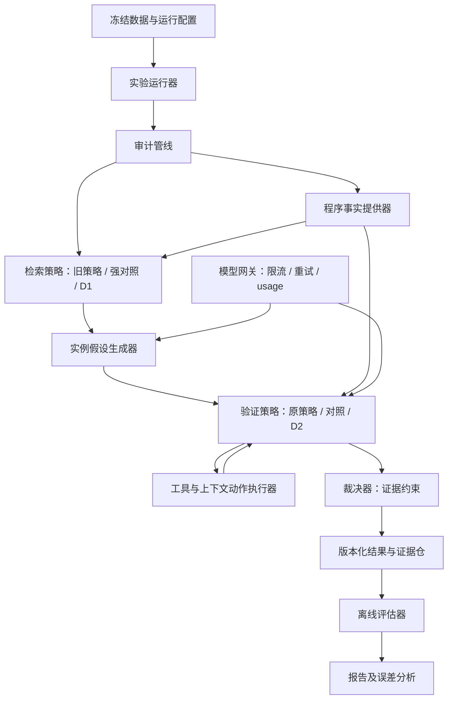

# 目标技术设计提案：可追溯审计与方法实验管线

## 1. 控制与适用边界

- Proposal ID：`DESIGN-R0-01`；目标 Release：`R0-20260918`。
- Status：`PROPOSED`；更新：2026-09-18；编写：Codex；审核：用户。
- 关联：REQ-01—REQ-16；DEC-01—DEC-06，全部待批准。
- 当前需求为 DRAFT；本文件是用户明确要求准备的待审核方案，不是当前架构或已批准技术基线。

目标：将数据、检索、程序事实、假设、验证、裁决、实验分别解耦，能够只替换 D1 或 D2，证明各自贡献。模型只提出候选和解释，不能改写运行预算、样本标签、工具白名单或实验记录。

## 2. 架构取舍

| 选项 | 优点 | 代价 | 判断 |
|---|---|---|---|
| A：全部 Java 模块化 | 运行方式一致，现有代码复用最多 | 程序分析和数据处理生态接入较慢，最终可能仍要执行 Python 工具 | 可行备选 |
| B：Java 编排 + Python 本地工作进程 | 保留主工程，利用 Slither/Python 数据生态；本地协议可重放、可模拟 | 需要版本化进程协议和双侧测试 | 推荐 |
| C：Python 全重写或服务化 | 学术原型集中，快速接入现成研究代码 | 迁移、环境、部署和回归范围最大；服务化增加运维状态 | 当前不推荐 |

推荐 B 不意味着拆成多个常驻服务。第一阶段保留单 Maven 工程，按领域包拆分；Python 使用一个受控依赖环境和按需启动的进程。只有明确性能瓶颈才考虑常驻 worker。框架全面升级不作为第一步，依赖版本以干净环境编译和适配测试决定。

## 3. 拟议组件与依赖方向

所有阶段通过纯数据契约交互；基础运行器拥有预算、重试、记录与终止权。知识库及评估标签分离，检索进程不可访问 test 标签。D1 与 D2 可以共用确定性程序事实缓存，缓存构建成本须记录并对比较组公平分摊。

| 建议模块 | 拟放置路径（均尚未创建） | 职责 / 禁止事项 |
|---|---|---|
| domain | `src/main/java/com/xhl/xhlaiagent/audit/domain/` | 样本、假设、条件、证据、运行状态；不依赖 Spring/Milvus |
| pipeline | `.../audit/pipeline/` | 阶段顺序、策略选择、预算、检查点；不解析工具原始 JSON |
| retrieval | `.../audit/retrieval/` | 旧策略、dense/hybrid/正反例对照、D1；不读取 GT |
| verification | `.../audit/verification/` | 条件义务、证据更新、补查和停止；不启动任意 shell |
| adapters/model | `.../audit/adapters/model/` | 模型请求、结构校验、usage、失败分类；不决定安全标签 |
| adapters/tool | `.../audit/adapters/tool/` | 进程管理、Slither/Mythril 解析、能力声明 |
| adapters/knowledge | `.../audit/adapters/knowledge/` | 冻结案例与 Milvus 索引；不在启动时导入 |
| experiment | `.../experiment/` | run / resume / replay / evaluate 的独立入口；不充当 JUnit 测试 |
| Python 支撑 | `research_worker/` | 清单校验、克隆候选、受限程序事实提取；一请求一可验证输出 |
| 版本化产物 | `datasets/manifests/`、`runs/<runId>/` | 清单与运行产物；原始数据、秘密和大文件按单独策略存放 |

目录是实现建议；普通内部命名由 Agent 自主调整。跨语言契约和结果语义属于需要审核的架构内容。

## 4. 关键数据契约提案

不增加关系数据库。规范 JSON/JSONL 是本地权威记录，Milvus 只作可重建索引。以下字段及约束用于审核语义，冻结后再生成正式 Schema 与代码。

| 类型 | 核心字段 | 不变量 |
|---|---|---|
| SourceBundle | sampleId、sourceHash、files[path/hash]、entryContracts、compilerVersion、dependencyLockHash | 相对路径不得越出包根；行号为原始源文件 1-based；转换产物必须有 source map |
| LabelRecord | sampleId、findingIds、type、locations、labelScope、reviewStatus、source、projectGroup、cloneGroup | 不进入模型请求；unknown 不是负例；同一修复对不得跨数据 split |
| KnowledgeCase | caseId、sourceHash、mechanism、riskOperation、preconditions、guardObligations、reviewStatus、pairId、provenance | 自动抽取字段与人工核验分开；向量相似度不等于适用性 |
| EvidenceBundle | caseIds、bindings、supportCases、contrastCases、unresolvedConditions、tokenUsage | 无匹配反例时列表可空且明确原因；不得生成虚假案例来源 |
| Hypothesis | hypothesisId、mechanism、sourceSpans、actor/resource、pathScope、preconditions、guardClaims、sourceEvidenceIds、origin | hypothesisId 对应具体实例；模型/规则来源分开；引用必须存在 |
| Obligation | obligationId、hypothesisId、predicate、scope、requiredEvidenceKinds、critical、state | 状态与版本可追踪；重复更新不可悄悄覆盖冲突 |
| EvidenceItem | evidenceId、kind、producer/version、sourceSpans、artifactHash、scope、supports/refutes、executionId | 重复 LLM 发言不是独立证据；需目标源码或工具可核对来源 |
| ToolExecution | executionId、tool/version、compiler、argvDigest、exitCode、status、duration、stdout/stderrRef、outputTruncated、cleanupStatus | status 与 findings 独立；无报警不是 refutation；工具失败可保留部分证据但标不完整 |
| AuditResult | schemaVersion、runId、sampleId、executionStatus、findings[verdict/evidence/limitations]、unresolved、coverage、cost | 没有 finding 不自动输出“Safe”；不把整个合约的存在性判断套到每个实例 |
| RunManifest | configHash、codeCommit/dirtyHash、dataset/kb/model/prompt/toolVersions、seeds、budgets、mode、timestamps | 影响预测的配置全部可追踪；重放不能静默换知识快照 |

模型缺字段、类型错误、不存在的引用均为校验失败，不以默认 boolean 补全。可进行一次预算内格式修复，但保留原始输出和修复记录；仍失败为结构错误。修复不能修改标签或伪造证据。

### 状态必须分层

- 执行层：`COMPLETED / PARTIAL / FAILED / CANCELLED`。
- 调用层：`OK / TIMEOUT / COMPILE_ERROR / PARSE_ERROR / UNAVAILABLE / UNSUPPORTED / SKIPPED / EXECUTION_ERROR`。
- 命题层：`SUPPORTED / REFUTED / UNKNOWN / CONFLICT`；失败原因保存在对应证据获取记录。
- 假设裁决层：`SUPPORTED / REFUTED / UNRESOLVED`，均带范围；SUPPORTED 表示在指定核验义务与证据标准下得到支持，不能等同数学证明。

例如：Slither 成功无报警 → 调用 OK，命题可能 UNKNOWN；源码路径上的有效权限检查得到验证 → 对该越权假设的必要条件可构成反证；Mythril 超时 → 调用 TIMEOUT，不能生成 REFUTED。

## 5. D1 的具体设计提案

### 5.1 输入与阶段

输入为目标 SourceBundle、冻结案例库及预算。先提取有来源位置的风险操作和条件事实，召回候选案例，再做条件绑定与互补选择，最后输出 EvidenceBundle。

1. **表示**：案例包含谁操作什么资源、触发前提、状态读写、检查对象与时序。优先用源码/静态事实约束，LLM 抽取只作候选。
2. **绑定**：将案例中的主体、资源、状态槽和操作映射到目标程序。对别名、动态调用或路径不明保留 UNKNOWN，不按名称强行对应。
3. **适用性**：区分“风险操作相似”“必要条件得到支持”“关键条件矛盾”“未知”。与目标条件矛盾的漏洞例不能作为直接支持，但可作为说明差异的对比例。
4. **联合选择**：在固定 Token 预算内，选择覆盖风险前提的支持例以及能够区分关键保护条件的对比例；惩罚同一 case 的重复 chunk 和高度重复信息。
5. **解释**：证据包标明哪些条件相同、哪些不同、哪些未知，而非只提供安全/不安全标签。

可实验的初始选择目标是“适用条件覆盖 + 关键条件对比增量 − 重复信息 − 长度成本”。不把未测过的权重写成已成立算法；先以可解释规则/贪心选择实现，再在开发集决定是否需要学习排序。通用 hybrid/reranker、随机反例、普通正反例均作为强对照，不能只与旧 Top-3 比。

### 5.2 核心边界

D1 判断检索证据是否适用，不负责证明目标安全。相似度仅用于召回，不是置信度。源文件的 `require`、`onlyOwner` 字面出现不构成有效保护。案例中的正确补丁也只能说明该漏洞实例被修复，不能据此标整个项目安全。

对同一个机制，支持例和反例须有经核验的区别，不能只靠不同项目名字或标签。正反例“成对”是方法输入的审核要求，生成模型不得自判自己生成的补丁有效。

## 6. D2 的具体设计提案

### 6.1 条件账本与动作选择

每个假设映射为必要条件与保护义务。以受限重入为例：可达外部调用、攻击者可影响的重入入口、相关状态更新顺序、影响同一资源的保护及旁路；以越权为例：入口可达性、调用主体权限、被修改资源、检查是否覆盖危险操作。初期每个机制有可审查的义务模板，不声称统一解决所有 Solidity 语义。

先把初始源码事实和工具报警映射到账本。随后从动作白名单选择能填补关键缺口的动作：补取 caller/modifier 及所需源码范围、查询静态数据/控制关系、在支持的机制和编译范围内运行有界工具。动作优先级先用可解释的“影响裁决的关键缺口优先 + 成本/能力约束”，不称为已实现的信息增益学习算法。

当前 Mythril CLI 只提供整合约检查；初期仅作为可选粗粒度证据，不能命名为“假设引导深度求解机”。真正命题级求解需另行验证工具能力与约束映射。若无法可靠映射，保留 UNSUPPORTED，首月不改写引擎内部。

### 6.2 裁决表

| 条件 | 裁决 | 限制 |
|---|---|---|
| 关键必要条件均有可核对支持，相关保护义务已检查，未解冲突为零，满足该机制规定的联合证据要求 | SUPPORTED | 若只有模型陈述或不相容路径上的孤立事实，不满足此条件 |
| 明确反证推翻该假设的必要条件，且反证覆盖该假设声明的路径/主体/资源范围 | REFUTED | 一个路径存在 guard 不足以否定全部路径；缩小裁决范围或保留未决 |
| 关键义务缺证、作用域不明、证据冲突、工具失败或预算用尽且无法满足前两项 | UNRESOLVED | 不输出安全；已有其他已支持实例仍可保留 |

“条件覆盖率=100%”本身不能证明漏洞；还需证据质量、范围一致和必要条件联合可满足。LLM 引用已有证据的解释不能再作为第二份独立证据。冲突通过来源/版本/作用域核对和补查处理，不用工具多数票覆盖少数有效反证。

### 6.3 双向纠错与停止

接受假设要防错误接受；拒绝假设要防错误拒绝。缺一段解释只触发补查，不自动反驳。程序事实解析失败不降格为 guard 不存在。

建议开发默认每假设最多 3 次补查，每样本总预算另限；这只是待审核运行参数，必须在开发集检验饱和点。满足证据要求、预算到限、无适用动作、重复动作无新增证据或用户取消时停止。禁止无界重试和“自我反思直到一致”。

## 7. 执行器、模型网关与本地协议

### 进程执行

Java 使用参数数组创建进程，独立 stdout/stderr 读取任务，从启动时建立 deadline；限制输出长度并在达到上限后继续排空或安全终止，不让管道反压卡住。超时先终止、再强制清理后代进程，记录未清理成功；临时目录独立，保留必要证据后清理。不能依赖工具内部 timeout 等价于外层墙钟限制。

Python 请求/响应为版本化 JSON 文件或标准输入输出单条协议，stdout 只输出协议，日志写 stderr；请求包含 action、source hash、允许的源码路径、预算和 requestId；响应包含 schemaVersion、facts/artifacts、status、duration。输出校验失败时不得注入 D1/D2。路径必须限定在允许工作区内；不执行仓库提供的任意安装或构建脚本。首期不拉取未锁定的远程依赖。

### 模型与费用

保留 OpenAI 兼容网关思路，供应商、model ID、endpoint 来自环境/本地非跟踪配置。DeepSeek 名称与方舟实际端点映射需预检查，不能由显示名称推断请求参数。每个逻辑调用有稳定 ID，每次尝试另有 ID；超时可能已在服务端计费，标记未知而不是记零。

重试只针对明确瞬态错误，指数退避受 run deadline 约束；非法请求/鉴权失败停止。底层 SDK 与外层重试合计次数必须受控。usage 在 JSON 清理前保存；缺失时记 null，可另列估算量及估算方法。已有 embedding 服务不自动换供应商或大批重建；快照包含 embedding 型号、维度和文本规范版本。

## 8. 数据迁移、兼容与恢复提案

| 项目 | 建议行为 |
|---|---|
| 旧 Java 入口 | 保留供 legacy 对照，不把新结果三态强制挤进旧 boolean；新研究入口版本化 |
| 旧报告 | 只读保留，标明旧数据和计分版本；不得与新正式实验直接合表 |
| 旧知识集合 | 不原地删除或覆盖。新 snapshotId 对应新集合或明确隔离分区，具体适配以本地 Milvus 能力验证后定 |
| 新案例主键 | 内容哈希 + 案例语义版本 + 来源标识形成稳定 ID；chunk ID 再加范围，不用随机 Document ID 作为唯一事实身份 |
| 构建阶段 | STAGING → 内容/数量/维度/来源验证 → READY → 人工认可范围内切换 active 指针；失败保持旧指针 |
| 回退 | 停止新 run、恢复旧配置指针；旧文件和集合原封不动；新失败产物隔离不覆盖成功记录 |
| 历史回填 | 不把旧日志臆测补全成新 evidence；缺失字段明确 unknown，仅可作历史分析 |
| 保留/删除 | 本轮提案默认不自动删除旧数据；大产物保留期和清理规则另经用户确认，首期没有自动 TTL |

JSON 数据语义、知识隔离与新入口兼容策略属于 DEC-03/04 的审核内容；当前没有运行 Schema、索引、集合迁移或数据回填。

## 9. 测试与验证设计

| REQ/AC | 必需测试 | 证据 |
|---|---|---|
| 01/07/08/12 | 严格 schema、引用、状态及裁决表驱动夹具 | 离线测试报告、固定输入输出 |
| 03/14/15 | 无密钥无网络装配、故障注入、预算/日志检查 | 请求计数为零或受限；脱敏日志样本 |
| 04 | 受控子进程挂起/大输出/后代进程 | 墙钟记录、退出和残留检查 |
| 05/11 | 半构建恢复、重复 ID、跨集合冲突、投毒标签夹具 | 构建 manifest、阻断原因与复核清单 |
| 06/13 | D1 条件配对与四组策略替换 | 相同配置摘要、选例解释、消融数据 |
| 09/10/16 | 中断恢复、阶段重放、旧新口径固定算例 | 阶段计数、费用尝试记录、离线报告一致性 |

所有运行测试在实施后执行；本轮仅完成设计和源码检查。完整实验评价规则由 [实验协议](EXPERIMENT_PROTOCOL.md)负责，避免设计文档重复维护指标公式。

## 10. 批准与未决

Decision：`PENDING`。用户审核 DEC-01—06 后才能标为 APPROVED。未解决项：首期机制范围、真实负例可用性、方舟实际额度/限流、目标输入版本覆盖、月内样本规模。无证据证明 D1/D2 优于最近方法，本提案不作此保证。
