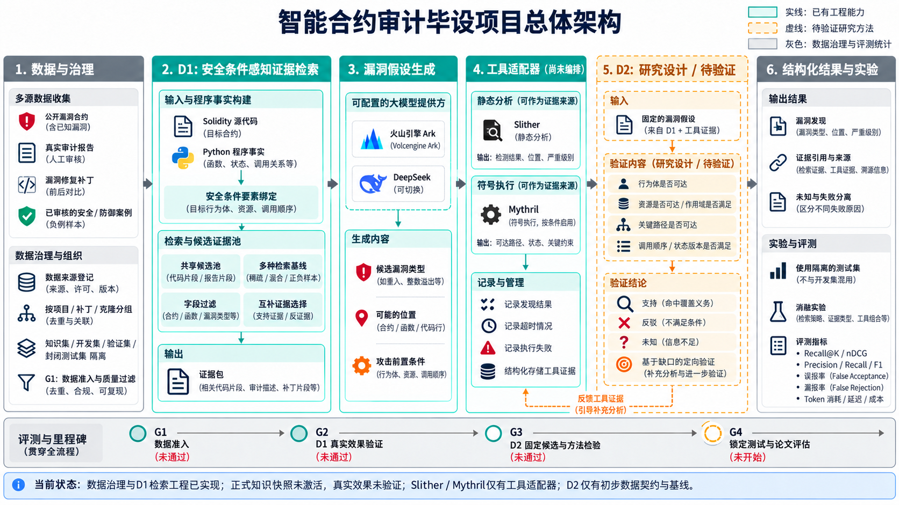
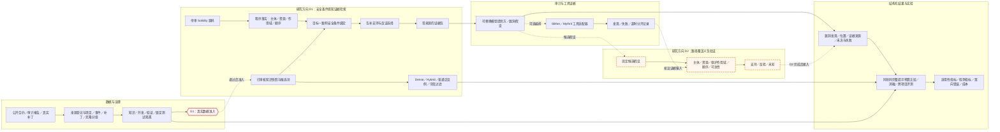

# 毕设项目总体架构（2026-10-04）

图例：青色实线表示已有工程能力；橙色虚线表示尚未完成研究验证的方法。架构图表达**目标方案与当前进度**，不代表所有箭头已形成运行时闭环。

## 可编辑的准确结构

## 当前状态与研究门禁

1. 数据谱系、分组门禁、D1 检索策略、工具适配器和本地演示链路已有工程实现。正式知识快照尚未激活，现有演示 Milvus 集合不能用于论文效果结论。
2. D1 的核心方法尚须在真实、独立审核样本上，以相同知识快照、候选池、完整提示 token 预算与强基线比较。S2/S3 离线测试验证工程契约，不验证科研收益。
3. Slither/Mythril 已有适配接口；图中到 D2 的工具证据箭头是后续编排方向，不表示当前运行时自动执行完整验证。
4. D2 目前只有固定候选与简单基线的数据契约；路径覆盖义务及定向补查仍属高风险研究设计。支持／反驳／未知不能误写成已完成系统能力。
5. G1 为数据准入，当前未通过；G2 为 D1 真实效果检验；G3 为 D2 固定候选方法检验；G4 为锁定测试与论文评估。锁定测试不能用于调参。

依据：[当前进度](../../../PROGRESS.md)、[S3 需求](../SPEC.md#r1-data)、[D1 知识库准入记录](D1_KB_READINESS.md)、[D1/D2 第二轮查新](../../../../../thesis/D1_D2第二轮查新与立题裁决_20260924.md)。
